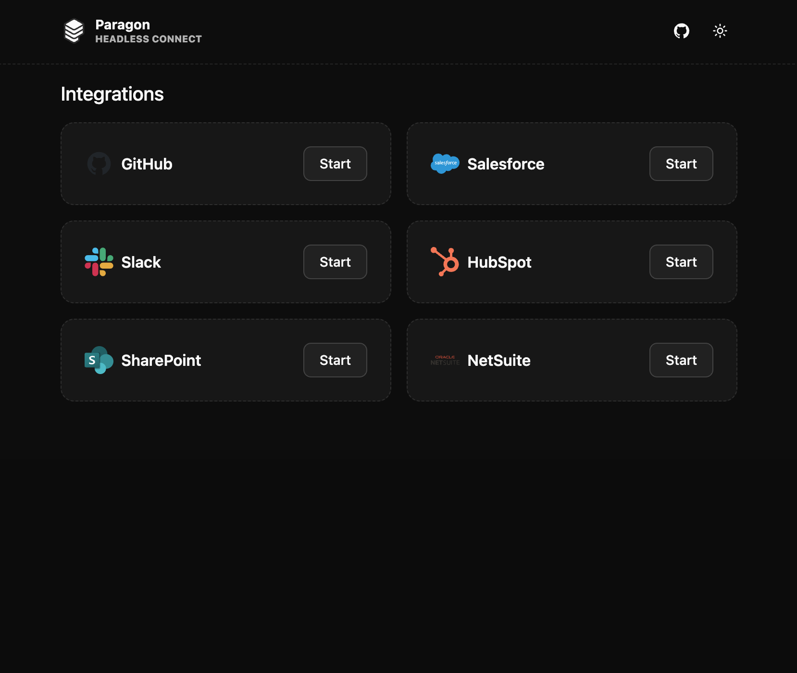

# Connect Headless Example

The Headless Connect Portal can be used with your own UI components or design system to make your integrations feel native to the design of your app, while leveraging the Paragon SDK for all of the backend details of connecting and configuring your users’ integrations.

Headless mode still provides fully managed authentication, so you don’t need to worry about managing, storing, or refreshing your customers’ credentials.

<p align="center">
  
</p>

## Configuration

To use the features of this demo, you will need a Paragon account. [Start for free](https://dashboard.useparagon.com/signup) today

1. Duplicate or rename the `.env-example` to `.env`
2. Paste in your Project ID and a JWT token into the values of `.env`, at the root of the repository. For quick token generation, you can use our [Paragon JWT Generator](https://jwt.useparagon.com/).

```
VITE_PARAGON_PROJECT_ID=""
VITE_PARAGON_JWT_TOKEN=""
```

## Installation

Install dependencies:

```
npm install
```

Start the application dev server:

```
npm run dev
```

After the demo has started, you can visit:

```
http://localhost:5173
```
